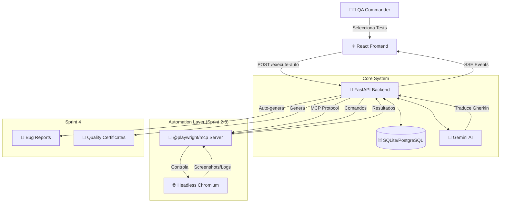

# 🚀 PROJECT MASTER PLAN: QA AUTONOMOUS PLATFORM
**Nombre Clave:** Quality Mission Control
**Fecha de Actualización:** 19 Noviembre 2024
**Estatus Global:** 🟢 Sprint 1 COMPLETO | 🟡 Iniciando Sprint 2

---

## 1. LA VISIÓN: "QUALITY MISSION CONTROL"

Hemos redefinido el propósito de la herramienta. No construimos un gestor de documentos, construimos una **Plataforma de QA Híbrida/Autónoma**.

### El Cambio de Paradigma
* **Antes (Tradicional):** El QA lee un test, va a la aplicación, hace clic, toma una captura, la pega y reporta.
* **Ahora (Nuestra Visión):** El QA es un **Comandante de Misión**. Selecciona objetivos (Tests) y supervisa a una **IA Agente (MCP)** que ejecuta las acciones en el navegador.
* **Promesa de Valor:** "Automatización Zero-Touch". De Historia de Usuario a Ejecución sin escribir una sola línea de código de script.

### Flujo de Evolución (Manual → Autónomo)

```
SPRINT 1 (Manual):
QA → Ejecuta paso a paso → Marca ✅❌ manualmente

SPRINT 2 (Infraestructura MCP):
Backend → Conecta con MCP Server → Ejecuta comandos Playwright

SPRINT 3 (Supervisión):
MCP Agente → Ejecuta test automáticamente → Marca ✅❌ por cada step
QA → Solo supervisa → Aprueba/Corrige resultado final

SPRINT 4 (Autónomo):
MCP Agente → Ejecuta → Falla un step → Auto-genera Bug Report
QA → Solo revisa dashboard → Certifica calidad
```

---

## 2. ESTADO ACTUAL

### ✅ SPRINT 1 COMPLETO (19 Nov 2024)

Hemos construido los **cimientos completos** de la plataforma con capacidad de ejecución manual por scenarios.

#### Backend Completado:
1. **✅ Arquitectura Modular:**
   - Refactorización `routes.py` (Monolito) → `api/endpoints/` (Modular)
   - Endpoints organizados:
     - `projects.py` - Multi-project support
     - `stories.py` - User stories con acceptance criteria
     - `test_cases.py` - Test cases con Gherkin
     - `executions.py` - **NUEVO:** Ejecuciones con step results
     - `bugs.py` - Bug reports
     - `stats.py` - Estadísticas y métricas
     - `reports.py` - Generación de documentos

2. **✅ Base de Datos:**
   - `TestExecutionDB` con campo JSON `step_results` para almacenar estados por step
   - Sistema de evidencias con upload de archivos
   - Relaciones: Project → UserStory → TestCase → Execution

3. **✅ API de Ejecución:**
   - `POST /test-executions` - Guardar ejecuciones con paso por paso
   - `POST /upload-evidence` - Subir evidencias (screenshots, videos, logs)
   - Estructura de carpetas: `uploads/{project_id}/{entity_type}/{date}/`

#### Frontend Completado:

1. **✅ Parser de Gherkin con Scenarios:**
   - `gherkinParser.ts` - Parse completo de archivos .feature
   - Detecta: Feature, Scenarios, Tags (@smoke, @regression)
   - Agrupa steps por scenario
   - Funciones auxiliares: `calculateScenarioStatus()`, `calculateOverallStatus()`

2. **✅ Motor de Ejecución Manual:**
   - `useTestRunner.ts` - Hook con lógica de scenarios
   - Estados independientes por scenario
   - Cronómetro global
   - Sistema de evidencias (File upload)
   - Auto-skip de steps cuando uno falla en el scenario

3. **✅ TestRunnerModal - UI Scenario-Based:**
   - Accordion collapsible por scenario
   - Cada scenario muestra:
     - Nombre del scenario
     - Contador de steps (X/Y passed)
     - Lista de steps con botones ✅❌
     - Área de evidencia (solo en steps fallidos)
   - Header con:
     - Nombre de Feature
     - Cantidad de scenarios y steps totales
     - Cronómetro global
     - Status general (PASSED/FAILED/IN_PROGRESS)
   - Guardar ejecuta:
     1. Upload de evidencias al backend
     2. Construcción de payload con todos los steps
     3. `POST /test-executions`
     4. Actualización de status del test case en tabla

#### Arquitectura Scenario-Based (Clave para Sprint 2-3):

```typescript
// Parser estructura perfecta para MCP:
interface GherkinFeature {
  featureName: string;
  scenarios: GherkinScenario[]; // Lista de "misiones"
}

interface GherkinScenario {
  scenarioIndex: number;
  scenarioName: string;
  steps: GherkinStep[];        // Steps de la misión
  status: 'pending' | 'passed' | 'failed' | 'skipped';
  tags: string[];              // @smoke, @critical, etc.
}
```

**¿Por qué esto es perfecto para MCP?**
- Cada `GherkinScenario` es una **misión independiente** que el agente ejecutará
- Si un step falla en Scenario 1 → MCP detiene ese scenario
- **PERO** MCP continúa con Scenario 2, 3, 4... (no detiene todo el test)
- Los botones ✅❌ existen en Sprint 1 (QA manual) y Sprint 3 (MCP automático)
- **Solo cambia quién los presiona:** Humano → Agente

---

## 3. RECURSOS DISPONIBLES PARA SPRINT 2

### 📂 Implementación MCP de Referencia (`/services/`)

Tenemos una **implementación completa de MCP Playwright** de otro proyecto que sirve de guía:

#### Archivos Clave:

1. **`MCPManager.ts`** - Singleton manager
   - Gestiona una única instancia MCP compartida
   - Evita múltiples conexiones
   - Métodos: `startMCP()`, `stopMCP()`, `restartMCP()`

2. **`McpClientService.ts`** - Cliente MCP robusto ⭐
   - Conexión vía `StdioClientTransport` (protocolo nativo)
   - Verificación de navegadores Playwright
   - Métodos principales:
     - `navigateToUrl(url)` - Navegar a página
     - `getCompleteContext()` - Obtener ARIA tree + HTML snapshot + Screenshots
     - `getJavaScriptElementData()` - Ejecutar JS en browser con `browser_evaluate`
     - `improvedCorrelation()` - Correlacionar elementos ARIA con HTML reales
     - `generatePlaywrightSelectors()` - Generar 5 selectores priorizados por elemento
   - Herramientas MCP usadas:
     - `browser_navigate` - Navegar
     - `browser_snapshot` - ARIA tree
     - `browser_console_messages` - Logs
     - `browser_network_requests` - Network
     - `browser_take_screenshot` - Screenshots
     - `browser_click` - Click usando `ref` (índice ARIA)
     - `browser_type` - Escribir texto
     - `browser_wait_for` - Esperar

3. **`AIWithMCPService.ts`** - IA + MCP integration ⭐⭐
   - **`exploreUserStoryWithMCP()`** - IA explora user story usando MCP
   - **`askAIWhatToDo()`** - IA decide qué hacer con contexto MCP
   - **`executeMCPAction()`** - Ejecuta acción (navigate, click, type, wait)
   - **`generateSelectorsFromExperience()`** - Genera selectores desde la exploración
   - **`generateFinalAIResponse()`** - Convierte experiencia a JSON para test automation

4. **`UniversalMcpExtractor.ts`** - Extractor universal de elementos
   - Combina ARIA tree + HTML snapshot
   - Genera selectores Playwright robustos

#### Lecciones Aprendidas de `/services/`:

✅ **Usar StdioClientTransport** (no spawn manual):
```typescript
this.transport = new StdioClientTransport({
  command: 'npx',
  args: ['@playwright/mcp@latest']
});

this.mcpClient = new Client({
  name: 'qa-orchestrator',
  version: '1.0.0'
});

await this.mcpClient.connect(this.transport);
```

✅ **Click/Type usando refs de ARIA tree:**
```typescript
await mcpClient.callTool({
  name: 'browser_click',
  arguments: {
    element: 'Submit Button',
    ref: '42' // Índice del elemento en ARIA tree
  }
});
```

✅ **Correlación ARIA + HTML para selectores robustos:**
- ARIA tree da `role`, `name`, `ref` (para MCP)
- HTML snapshot da `id`, `className`, `placeholder`, `type` (para selectores)
- Combinar ambos = selectores priorizados (getByRole > getByLabel > CSS)

---

## 4. ROADMAP SPRINTS 2-4

### 🤖 SPRINT 2: Infraestructura del Agente (Cerebro y Manos)
**Objetivo:** Backend puede controlar navegador real sin intervención humana.

#### 2.1 Servidor MCP Playwright
**Ubicación:** `backend/integrations/mcp_server.py`

```python
from modelcontextprotocol.server import Server
from modelcontextprotocol.server.stdio import StdioServerParameters
import playwright.async_api as pw

class PlaywrightMCPServer:
    """
    Servidor MCP que expone herramientas Playwright
    Basado en @playwright/mcp pero en Python
    """

    async def start_server(self):
        # Iniciar servidor MCP STDIO
        server = Server("playwright-qa-server")

        # Registrar herramientas:
        @server.tool("navigate")
        async def navigate(url: str):
            await self.page.goto(url)
            return {"success": True, "url": self.page.url}

        @server.tool("get_snapshot")
        async def get_snapshot():
            # Obtener ARIA tree
            snapshot = await self.page.accessibility.snapshot()
            return {"snapshot": snapshot}

        @server.tool("click_element")
        async def click_element(ref: int):
            # Usar ref del ARIA tree para click
            element = self._get_element_by_ref(ref)
            await element.click()
            return {"success": True}

        # ... más herramientas
```

**Alternativa (Más Rápida):** Usar `@playwright/mcp` existente vía subprocess:
```python
# backend/integrations/mcp_client.py
import subprocess
from mcp import ClientSession, StdioServerParameters
from mcp.client.stdio import stdio_client

class MCPPlaywrightClient:
    async def connect(self):
        # Spawn @playwright/mcp como subprocess
        server_params = StdioServerParameters(
            command="npx",
            args=["@playwright/mcp@latest"]
        )

        # Conectar vía STDIO
        async with stdio_client(server_params) as (read, write):
            async with ClientSession(read, write) as session:
                await session.initialize()
                self.session = session

    async def navigate(self, url: str):
        result = await self.session.call_tool(
            "browser_navigate",
            arguments={"url": url}
        )
        return result

    async def get_context(self):
        # Obtener ARIA snapshot
        snapshot = await self.session.call_tool("browser_snapshot", {})
        # Obtener screenshot
        screenshot = await self.session.call_tool("browser_take_screenshot", {})
        return {"snapshot": snapshot, "screenshot": screenshot}
```

#### 2.2 Traductor Gherkin → MCP (Gemini)
**Ubicación:** `backend/integrations/gherkin_translator.py`

```python
from backend.integrations.gemini_client import GeminiClient

class GherkinToMCPTranslator:
    def __init__(self, gemini_client: GeminiClient):
        self.gemini = gemini_client

    async def translate_step(
        self,
        gherkin_step: str,
        context: dict  # ARIA tree + elementos disponibles
    ) -> dict:
        """
        Traduce un step Gherkin a comando MCP

        Ejemplo:
        Input: "When ingreso 'test@example.com' en el campo email"
        Output: {
            "tool": "browser_type",
            "element_ref": 15,  # ref del ARIA tree
            "params": {"text": "test@example.com"}
        }
        """

        prompt = f"""
        Eres un traductor de pasos Gherkin a comandos MCP Playwright.

        PASO GHERKIN:
        {gherkin_step}

        ELEMENTOS DISPONIBLES (ARIA tree):
        {json.dumps(context['elements'], indent=2)}

        HERRAMIENTAS MCP DISPONIBLES:
        - browser_navigate: Navegar a URL
        - browser_click: Click en elemento (usa ref del ARIA tree)
        - browser_type: Escribir texto (usa ref + text)
        - browser_wait_for: Esperar tiempo

        INSTRUCCIONES:
        1. Identifica la acción: navigate, click, type, wait
        2. Encuentra el elemento correcto usando role/name del ARIA tree
        3. Retorna JSON con: tool, element_ref, params

        Retorna SOLO JSON válido:
        {{
          "tool": "browser_type",
          "element_ref": 15,
          "params": {{"text": "test@example.com"}},
          "reasoning": "Campo de email identificado por role=textbox, name=email"
        }}
        """

        response = await self.gemini.generate(prompt)
        return json.loads(response)
```

#### 2.3 Endpoint de Ejecución Automática
**Ubicación:** `backend/api/endpoints/executions.py`

```python
@router.post("/test-executions/auto/{test_case_id}")
async def execute_with_mcp(
    test_case_id: str,
    db: Session = Depends(get_db),
    mcp_client: MCPPlaywrightClient = Depends(get_mcp_client),
    translator: GherkinToMCPTranslator = Depends(get_translator)
):
    """
    Ejecuta test case automáticamente usando MCP
    """

    # 1. Obtener test case y parsear Gherkin
    test_case = db.query(TestCaseDB).filter(TestCaseDB.id == test_case_id).first()
    feature = parseGherkinContent(test_case.gherkin_content)

    # 2. Iniciar MCP
    await mcp_client.connect()

    all_step_results = []
    execution_status = "IN_PROGRESS"

    # 3. Ejecutar scenario por scenario
    for scenario in feature.scenarios:
        for step in scenario.steps:
            # A. Obtener contexto actual
            context = await mcp_client.get_context()

            # B. Traducir step Gherkin → comando MCP
            mcp_command = await translator.translate_step(
                f"{step.keyword} {step.text}",
                context
            )

            # C. Ejecutar comando MCP
            try:
                result = await mcp_client.execute_command(mcp_command)

                step_result = {
                    "step_index": step.id,
                    "keyword": step.keyword,
                    "text": step.text,
                    "status": "PASSED",
                    "screenshot": result.get("screenshot"),
                    "evidence_file": None
                }

                # D. Enviar evento SSE al frontend
                await send_sse_event({
                    "scenario_index": scenario.scenarioIndex,
                    "step_id": step.id,
                    "status": "passed",
                    "log": f"🤖 AI: {mcp_command['tool']} → Success"
                })

            except Exception as e:
                # Step falló
                step_result = {
                    "step_index": step.id,
                    "keyword": step.keyword,
                    "text": step.text,
                    "status": "FAILED",
                    "error": str(e),
                    "screenshot": await mcp_client.take_screenshot()
                }

                await send_sse_event({
                    "scenario_index": scenario.scenarioIndex,
                    "step_id": step.id,
                    "status": "failed",
                    "log": f"🤖 AI: Error - {str(e)}"
                })

                # Detener este scenario, continuar con el siguiente
                break

            all_step_results.append(step_result)

    # 4. Guardar ejecución en BD
    execution = TestExecutionDB(
        test_case_id=test_case_id,
        executed_by="MCP Agent",
        status=execution_status,
        step_results=json.dumps(all_step_results),
        ...
    )
    db.add(execution)
    db.commit()

    return {"message": "Execution completed", "execution_id": execution.id}
```

**Tareas Sprint 2:**
- [ ] Instalar `@modelcontextprotocol/sdk` en backend
- [ ] Crear `backend/integrations/mcp_client.py` basado en `services/McpClientService.ts`
- [ ] Crear `backend/integrations/gherkin_translator.py` con Gemini
- [ ] Agregar endpoint `POST /test-executions/auto/{test_case_id}`
- [ ] **NO tocar frontend todavía** (sigue siendo manual)

---

### 👁️ SPRINT 3: Consola de Supervisión (Los Ojos)
**Objetivo:** Transformar TestRunnerModal en Monitor en Tiempo Real

#### 3.1 Server-Sent Events (SSE) Backend
**Ubicación:** `backend/api/endpoints/executions.py`

```python
from fastapi.responses import StreamingResponse

@router.get("/test-executions/stream/{execution_id}")
async def stream_execution(execution_id: str):
    """
    Stream eventos SSE de una ejecución en progreso
    """
    async def event_generator():
        while execution_in_progress:
            # Obtener último evento
            event = await get_next_execution_event(execution_id)

            yield f"data: {json.dumps(event)}\n\n"
            await asyncio.sleep(0.5)

    return StreamingResponse(
        event_generator(),
        media_type="text/event-stream"
    )
```

#### 3.2 Frontend - Actualizar TestRunnerModal

**Cambios en `TestRunnerModal.tsx`:**

```typescript
// NUEVO: Hook para SSE
useEffect(() => {
  if (!isAutoMode) return; // Solo en modo automático

  const eventSource = new EventSource(
    `/api/v1/test-executions/stream/${executionId}`
  );

  eventSource.onmessage = (event) => {
    const data = JSON.parse(event.data);

    // MCP marca el step automáticamente
    markStep(data.scenario_index, data.step_id, data.status);

    // Mostrar log
    appendLog(data.log); // "🤖 AI: Clicking Submit → Success"

    // Mostrar screenshot si existe
    if (data.screenshot) {
      showEvidence(data.step_id, data.screenshot);
    }
  };

  return () => eventSource.close();
}, [executionId, isAutoMode]);
```

**UI con Logs en Tiempo Real:**

```tsx
<div className="execution-logs">
  <h4>🤖 AI Agent Logs</h4>
  <div className="log-stream">
    {logs.map((log, idx) => (
      <div key={idx} className="log-entry">
        <span className="timestamp">{log.timestamp}</span>
        <span className="message">{log.message}</span>
      </div>
    ))}
  </div>
</div>

{/* Botones cambian según modo */}
{isAutoMode ? (
  // Durante ejecución automática: botones DESHABILITADOS
  <div className="auto-execution-controls">
    <p>🤖 El agente está ejecutando...</p>
    <button disabled>✅ Aprobar (disponible al terminar)</button>
  </div>
) : (
  // Modo manual: botones normales
  <button onClick={() => markStep(scenarioIdx, stepId, 'passed')}>✅</button>
)}
```

**Tareas Sprint 3:**
- [ ] Agregar endpoint SSE `/test-executions/stream/{id}`
- [ ] Actualizar `TestRunnerModal` con EventSource
- [ ] Agregar área de logs en UI
- [ ] Deshabilitar botones ✅❌ durante ejecución auto
- [ ] Habilitar botones **después** para override
- [ ] Agregar botón "✅ Aprobar Resultado IA"

---

### 🐛 SPRINT 4: Ciclo Autónomo & Reportes
**Objetivo:** Si falla, bug report automático

#### 4.1 Auto Bug Report
**Ubicación:** `backend/api/endpoints/bugs.py`

```python
@router.post("/bugs/auto-create-from-execution")
async def auto_create_bug(
    execution_id: int,
    failed_step_index: int,
    db: Session = Depends(get_db)
):
    """
    Crea bug report automáticamente desde step fallido
    """

    execution = db.query(TestExecutionDB).filter(
        TestExecutionDB.id == execution_id
    ).first()

    step_results = json.loads(execution.step_results)
    failed_step = step_results[failed_step_index]

    # Generar título y descripción con IA
    bug_title = f"Fallo en: {failed_step['text']}"
    bug_description = f"""
    **Test Case:** {execution.test_case_id}
    **Step Fallido:** {failed_step['keyword']} {failed_step['text']}
    **Error:** {failed_step.get('error', 'Unknown')}

    **Console Logs:**
    {failed_step.get('console_logs', 'N/A')}
    """

    # Crear bug draft
    bug = BugReportDB(
        title=bug_title,
        description=bug_description,
        severity=auto_detect_severity(failed_step),
        status="NEW",
        test_case_id=execution.test_case_id,
        evidence_files=json.dumps([failed_step.get('screenshot')]),
        ...
    )

    db.add(bug)
    db.commit()

    return {"bug_id": bug.id, "title": bug_title}
```

#### 4.2 Dashboard Ejecutivo
**Ubicación:** `frontend/src/pages/DashboardPage`

```typescript
// Gráfico Pass Rate por Scenario
<Chart
  data={scenarioPassRateData}
  title="Pass Rate by Scenario Type"
/>

// Heatmap de escenarios fallidos
<Heatmap
  data={failedScenariosLast7Days}
  title="Most Failed Scenarios (Last 7 Days)"
/>

// Botón generar certificado
<button onClick={generateQualityCertificate}>
  📄 Generate Quality Certificate (PDF)
</button>
```

**Tareas Sprint 4:**
- [ ] Endpoint `POST /bugs/auto-create-from-execution`
- [ ] UI: Sugerencia de bug al detectar fallo
- [ ] Dashboard con gráficos (Chart.js / Recharts)
- [ ] Generador PDF "Certificado de Calidad"

---

## 5. ARQUITECTURA TÉCNICA FINAL



---

## 6. DECISIONES ARQUITECTURALES CLAVE

### ✅ Por qué usar `@playwright/mcp` en lugar de Playwright directo:

1. **Protocolo Estándar:** MCP es un protocolo estándar de Anthropic para comunicación con herramientas
2. **Abstracción IA-Friendly:** Gemini puede razonar mejor sobre "herramientas MCP" que sobre código Playwright
3. **Reutilización:** Ya tienes implementación en `/services/` que funciona
4. **Refs ARIA:** MCP usa índices del ARIA tree, más robustos que selectores CSS

### ✅ Por qué Scenarios son perfectos para MCP:

1. **Misiones Independientes:** Cada scenario es una tarea autocontenida
2. **Fallo Aislado:** Si Scenario 2 falla, Scenario 3 sigue ejecutándose
3. **Granularidad:** Métricas por scenario (no solo por test case completo)
4. **IA Reasoning:** Gemini puede razonar sobre "scenario = objetivo" mejor que "test case gigante"

### ✅ Por qué NO reescribir el frontend en Sprint 2:

1. **Validación:** Sprint 1 manual ya validó que el motor de ejecución funciona
2. **Incremental:** Backend primero, luego UI
3. **Testing:** Puedes testear MCP desde CLI/Postman antes de tocar UI
4. **Risk Mitigation:** Si MCP falla, el manual sigue funcionando

---

## 7. MÉTRICAS DE ÉXITO

### Sprint 1 ✅ (Completado):
- [x] TestRunnerModal funcional con scenarios
- [x] Parser Gherkin completo (Feature, Scenarios, Steps, Tags)
- [x] Sistema de evidencias funcionando
- [x] Ejecuciones guardadas en BD con `step_results` JSON

### Sprint 2 (En Progreso):
- [ ] Conexión exitosa con `@playwright/mcp`
- [ ] Traducción Gherkin → MCP con Gemini funcionando
- [ ] Al menos 1 test case ejecutado 100% automático (sin UI actualizada)
- [ ] Logs del backend muestran: navigate → click → type → success

### Sprint 3:
- [ ] TestRunnerModal muestra logs en tiempo real
- [ ] QA puede ver ejecución automática step by step
- [ ] Botón "Aprobar Resultado IA" funcional
- [ ] Override manual funciona (QA puede corregir decisión del agente)

### Sprint 4:
- [ ] Bug report automático creado al detectar fallo
- [ ] Dashboard con al menos 2 gráficos (Pass Rate, Heatmap)
- [ ] PDF "Certificado de Calidad" generado automáticamente

---

## 8. PRÓXIMOS PASOS INMEDIATOS

### 🎯 Acción 1: Cerrar Sprint 1
**Antes de empezar Sprint 2:**
- [ ] **Smoke Test End-to-End:** Ejecutar flujo completo manual (Crear Test → Ejecutar con scenarios → Guardar → Verificar status cambió)
- [ ] **Validar Evidencias:** Confirmar que screenshots se guardan en `backend/uploads/{project_id}/execution/{date}/`
- [ ] **Commit Sprint 1:** Crear commit con mensaje:
  ```
  feat(sprint-1): Complete manual test execution with scenario-based runner

  ✅ Gherkin parser with scenarios support
  ✅ TestRunnerModal with accordion UI
  ✅ Step-by-step execution with evidence upload
  ✅ Execution persistence in database

  Sprint 1 complete. Ready for Sprint 2 (MCP integration).

  🤖 Generated with Claude Code
  Co-Authored-By: Claude <noreply@anthropic.com>
  ```

### 🎯 Acción 2: Preparar Sprint 2
**Setup inicial:**
1. Instalar dependencias MCP:
   ```bash
   pip install mcp anthropic-mcp-client
   npm install @modelcontextprotocol/sdk
   ```

2. Crear archivos base:
   ```
   backend/integrations/
   ├── mcp_client.py          # Port de services/McpClientService.ts
   ├── gherkin_translator.py  # Traductor Gherkin → MCP
   └── mcp_executor.py        # Orquestador de ejecución
   ```

3. Test básico de conexión:
   ```python
   # test_mcp_connection.py
   from backend.integrations.mcp_client import MCPPlaywrightClient

   async def test_connection():
       client = MCPPlaywrightClient()
       await client.connect()
       await client.navigate("https://google.com")
       context = await client.get_context()
       print(f"✅ Conectado. Elementos: {len(context['elements'])}")

   asyncio.run(test_connection())
   ```

---

## 9. RECURSOS Y REFERENCIAS

### Documentación:
- **MCP Protocol:** https://modelcontextprotocol.io/
- **@playwright/mcp:** https://github.com/microsoft/playwright-mcp
- **Gemini API:** https://ai.google.dev/gemini-api/docs

### Código de Referencia:
- `/services/McpClientService.ts` - Cliente MCP completo ⭐
- `/services/AIWithMCPService.ts` - IA + MCP integration ⭐
- `/services/MCPManager.ts` - Singleton pattern
- `/services/UniversalMcpExtractor.ts` - Extractor de elementos

### Arquitectura Frontend:
- `frontend/src/shared/lib/gherkinParser.ts` - Parser Gherkin
- `frontend/src/features/test-execution/` - Motor de ejecución
  - `model/useTestRunner.ts` - Hook con lógica
  - `ui/TestRunnerModal.tsx` - UI con scenarios

### Arquitectura Backend:
- `backend/api/endpoints/executions.py` - Endpoints de ejecución
- `backend/database/models.py` - Modelos BD (TestExecutionDB)
- `backend/integrations/gemini_client.py` - Cliente Gemini

---

## 10. LECCIONES APRENDIDAS

### ✅ Qué funcionó bien:
1. **Arquitectura modular desde el inicio** - Fácil agregar nuevos endpoints
2. **Scenarios como "misiones"** - Perfecto para MCP en Sprint 2-3
3. **JSON flexible en BD** (`step_results`) - No necesita migraciones al agregar campos
4. **Separación Frontend/Backend** - Podemos actualizar uno sin tocar el otro

### ⚠️ Qué mejorar:
1. **Documentar prompts de Gemini** - Crear archivo `prompts/gherkin_to_mcp.txt`
2. **Tests unitarios** - Agregar tests para parser y traductor
3. **Manejo de errores** - Mejorar feedback cuando MCP falla
4. **Performance** - Cachear contexto MCP (no obtener en cada step)

---

**Última Actualización:** 19 Noviembre 2024
**Próxima Revisión:** Al completar Sprint 2
**Owner:** Jordan (QA Automation Engineer)
**Co-Pilot:** Claude (AI Assistant)
